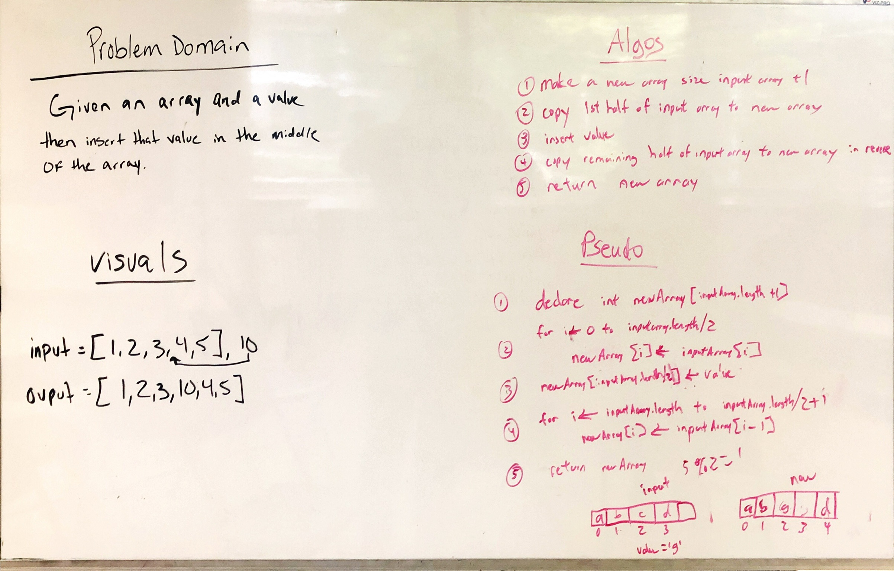

# Binary Search

This daily README contains information about the third code challenge, including a picture of the whiteboard completed and a link to the code.

(Note that if this challenge was a part of prework, it does not need to be in this file location or contain these links, but this is the correct template for future code challenges.)

[Link to code](../code401challenges/src/main/java/401codechallenges/AntBinarySearch.java)

[Link to tests](../code401challenges/src/test/java/401codechallenges/iAntBinarySearchTest.java)

